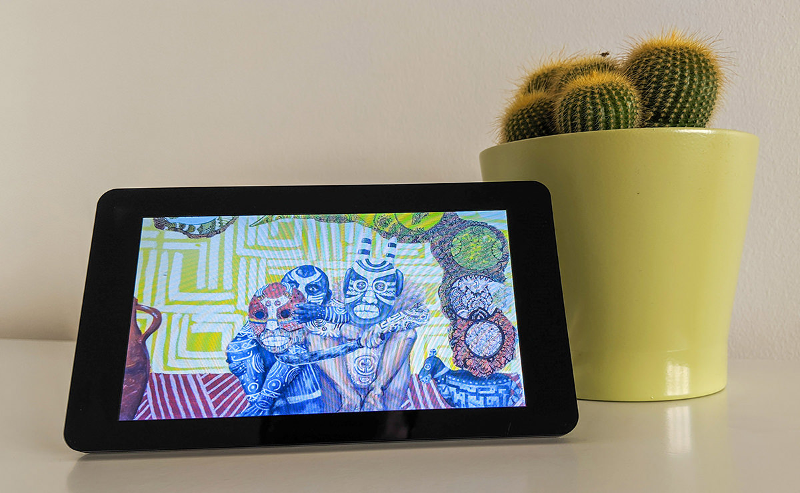

# Photo Slideshow

A simple project to quickly get you up and running with a web frame to display photo slideshow of your favourite photo albums hosted on Google Photo Albums, Dropbox Photo Album, or Apple Photos.

## Supported Albums

- Google Photos Albums
- Dropbox Photo Albums
- Apple iCloud Photo Album
- USB drive Photo Album

## Usage

You can deploy this project to a new balenaCloud application in one click using the button below:

Or, you can create an application in your balenaCloud dashboard and balena push this code to it the traditional way.

Please read the detailed project [tutorial](https://www.balena.io/blog/build-a-smart-photo-slideshow-with-balenacloud/) on our blog.

## Extra settings

This project uses the [photo-gallery](https://github.com/balenablocks/photo-gallery) and [browser](https://github.com/balenablocks/browser) blocks.

Please check the respective component's documentation for further customization.
